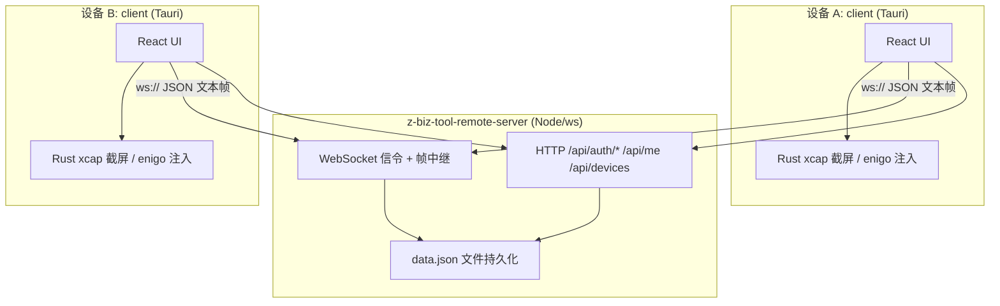

# 00 总览与优化优先级 — z-biz-tool-remote

> 状态：**设计方案，未实现**
> 基线：`b086d92`（`git rev-parse --short HEAD`，工作区 `nothing to commit, working tree clean`）
> 当前事实 = 静态代码证据（只读调研，未运行任何服务/构建/测试）
> 指标 = 拟定验收目标（**假设值，尚未实测**）

## 1. 项目定位与独特价值

`z-biz-tool-remote` 是 `z-biz-tool` 工具族中唯一的**跨机器远程控制类应用**：其它子项目是单机单进程、本地读写、失效后果限于本机；本项目是**双侧多进程 + 公网中继**、屏幕像素与键鼠事件**出网**、失效后果是**他人机器被操控**，安全等级等价于「远程 Shell + 远程屏幕」。

独特价值（值得继续投入的理由）：

1. **账号维度的「我的设备」一键互控**——同账号下多台自有设备免配对直连，这是 TeamViewer/AnyDesk 个人版与 RustDesk 共同的核心心智；本仓库已有账号体系雏形（[`auth.js`](../../z-biz-tool-remote-server/auth.js)）与设备归属表（[`storage.js`](../../z-biz-tool-remote-server/storage.js)）。
2. **自托管信令 + 单文件中继**——服务端仅依赖 `ws`（[`package.json`](../../z-biz-tool-remote-server/package.json) 单一依赖），可 `docker compose up` 落到私有机器，数据主权自持，这是相对商业方案最硬的差异点。
3. **Tauri 2 体积小、原生截屏/注入**——Rust 侧 [`capture.rs`](../../z-biz-tool-remote-client/src-tauri/src/capture.rs)（`xcap`）+ [`input.rs`](../../z-biz-tool-remote-client/src-tauri/src/input.rs)（`enigo`）已跑通，具备跨平台底座。
4. **双侧架构清晰**——`client` 与 `server` 各自独立打包、独立 CI、独立版本号，便于分别演进。

## 2. 双侧架构说明（本项目最容易误判的一点）

README 的表述（[`README.MD`](../../README.MD)）是「client = 主机/控制端，server = 信令服务器」。**这个表述与源码不一致，必须按源码理解：**

关键事实（均来自源码，非 README）：

- **同一个 Tauri 客户端同时承担「控制端」与「被控端」**，由 [`sessionStore.ts`](../../z-biz-tool-remote-client/src/stores/sessionStore.ts) 的 `role: "host"|"client"|null` + `isHosting`/`isControlling` 切换，视图在 [`App.tsx`](../../z-biz-tool-remote-client/src/App.tsx) 的 `view.kind` 上分发（`login`/`main`/`hosting`/`controlling`）。**不存在独立的「被控端 App」**。
- **服务端不只是信令，它同时是媒体中继**：屏幕帧走 `SCREEN_FRAME`、输入走 `INPUT_EVENT`（均在 [`server.js`](../../z-biz-tool-remote-server/server.js) 内 fan-out/转发）。即 **P2P 未实现、全部流量过服务器**；`package.json` 的 `keywords` 写了 `webrtc` 但仓库内无任何 WebRTC 代码（属元数据声明，非实现证据）。
- **仓库根的 [`src/agent/`](../../src/agent) 与 [`src-tauri/`](../../src-tauri) 是遗留孤儿**：`src/agent` 是 SQL Agent（`AgentManager.ts`/`SQLEditor.tsx`/`QueryHistoryViewer.tsx`），与远程控制无关且全仓无 import；`src-tauri/src/` 为空目录；根目录**没有 `package.json`**。

因此所有优化必须**同时落到 client 与 server 两侧**，任何只改一侧的方案都会造成协议不兼容。

## 3. 立即 P0（不做就别对外发布）

以下 5 条是「远程控制工具」这一品类的**红线**，均有明确代码证据，详见 [01_现状审计与问题清单](./01_现状审计与问题清单.md) 与 [04_数据安全与可靠性](./04_数据安全与可靠性.md)：

| 编号 | P0 项 | 证据位置 | 风险 |
| --- | --- | --- | --- |
| P0-1 | **传输零加密**：客户端 `toWsUrl()` 恒定拼 `ws://`，无法走 `wss://`；默认服务器是硬编码公网 IP | [`storage.ts`](../../z-biz-tool-remote-client/src/services/storage.ts) `toWsUrl` / `DEFAULT_SETTINGS.serverUrl` | 屏幕画面、键鼠事件、Bearer Token 全程明文过公网 |
| P0-2 | **`INPUT_EVENT` 服务端零鉴权**：只按 `targetId` 查 socket 直接转发，不校验发送者是否属于该 session、不校验 sessionToken | [`server.js`](../../z-biz-tool-remote-server/server.js) `handleMessage` 的 `INPUT_EVENT` 分支 | 任一登录用户只要猜到/枚举到 deviceId，即可向任意在线设备注入键鼠 |
| P0-3 | **被控端接收输入时不校验会话**：只判 `isHosting` 就 `invoke("simulate_input")` | [`App.tsx`](../../z-biz-tool-remote-client/src/App.tsx) INPUT_EVENT 监听段 | 与 P0-2 叠加 → 完整的远程接管链 |
| P0-4 | **`encryptionKey` 是假加密**：服务端回落到字面量 `"test-key"`，客户端存进 store 后**从未用于任何加解密** | [`server.js`](../../z-biz-tool-remote-server/server.js) `REGISTER_SUCCESS` 分支 / [`sessionStore.ts`](../../z-biz-tool-remote-client/src/stores/sessionStore.ts) | 给用户「已加密」的错觉，比不加密更危险 |
| P0-5 | **`GET_ONLINE_DEVICES` 无租户隔离**：向任意已连接客户端返回**全量** deviceId 列表 | [`server.js`](../../z-biz-tool-remote-server/server.js) `GET_ONLINE_DEVICES` 分支 + `listOnlineDevices()` | 为 P0-2 提供免费的 deviceId 枚举源 |

> P0-2 / P0-3 / P0-5 构成一条**可串联的攻击链**（枚举 → 注入 → 执行），且不需要破解加密、不需要中间人位置，只需一个能注册账号的网络位置。这是本项目当前最高优先级的单点问题，**优先于任何功能增强**。完整链路图与措施见 [04](./04_数据安全与可靠性.md) §0。

## 4. 分阶段能力路线（3–5 阶段概览）

详细任务编号、文件级改造点、前置依赖见 [05_实施路线与任务拆解](./05_实施路线与任务拆解.md)。

| 阶段 | 主题 | 核心产出 | 判定完成的一句话标准 |
| --- | --- | --- | --- |
| **S1 止血** | 安全红线 + 构建可用性 | wss 强制、INPUT_EVENT/SCREEN_FRAME 会话鉴权、租户隔离、Dockerfile & CI 修复 | 「明文不可用、越权不可达、镜像可构建」 |
| **S2 补齐已声明但不可用的能力** | 键盘输入、文件传输、聊天、一键互控 | ControlView 键盘事件、server 端 FILE_*/CHAT_* 路由、`sameUser`/`ephemeral` 真正落地 | 「UI 上存在的按钮，点了都有端到端效果」 |
| **S3 传输与性能** | 二进制帧、脏区/增量、带宽自适应、Rust 侧推流 | 帧率与延迟达标，CPU/带宽下降 | 「1080p@15fps 在 5Mbps 下行可稳定观看」 |
| **S4 可靠性与多会话** | 断线重连恢复、心跳统一、多显示器、并发会话 | 会话可恢复、被控端可控可断 | 「拔网线 30s 内自动恢复且不丢授权」 |
| **S5 体验与运维** | 被控端可见性、审计日志、i18n、跨平台持久化、Agent 边界 | 隐私指示灯、审计流、en-US、Windows 持久化 | 「被控端随时知道谁在看、能一键断」 |

## 5. 文档索引

| 文档 | 内容 |
| --- | --- |
| [01_现状审计与问题清单](./01_现状审计与问题清单.md) | 逐文件证据、行号、已确认缺陷 / 待验证假设 / 已存在能力三分类 |
| [02_产品能力与交互优化](./02_产品能力与交互优化.md) | 设备发现→配对→连接→屏幕→输入→多屏→会话→重连→文件→Agent 全流程缺口与优先级 |
| [03_技术架构与性能优化](./03_技术架构与性能优化.md) | 通信协议与传输、编解码、进程模型、连接生命周期、跨平台、并发多会话的**明确推荐** |
| [04_数据安全与可靠性](./04_数据安全与可靠性.md) | **重点**：认证配对、TLS、防中间人、会话授权、注入边界、危险操作确认、凭证存储、Agent 约束、Tauri 权限收敛、隐私 |
| [05_实施路线与任务拆解](./05_实施路线与任务拆解.md) | S1–S5 文件级改造点、任务编号、前置依赖、角色、资源假设、兼容与回滚 |
| [06_测试验收与风险清单](./06_测试验收与风险清单.md) | 单元/集成/E2E/故障注入/安全/性能测试矩阵、量化验收指标、风险与缓解 |

## 6. 四条不可妥协的核心原则

后续所有文档的方案都必须同时满足这四条，任何冲突以本节为准（详细展开见 [04](./04_数据安全与可靠性.md) §15）：

1. **传输必须加密**——生产环境不接受 `ws://`；`wss://` 为默认且可强制，自签证书需显式 pinning 而非静默放行。
2. **配对与认证必须双向可验证**——deviceId 不可被他人冒名 claim；session 参与方必须在服务端有成员表；控制请求必须携带可校验凭证。
3. **被控端永远可控可断**——被控端必须有持续可见的「正在被谁控制」指示、一键断开、一键暂停输入；`requirePermission` 不可被远端绕过；信任列表不可由远端写入。
4. **Agent 不得自动执行破坏性操作**——任何 Agent / 自动化路径都不得自主发起 `simulate_input`、文件写入、`shell` 调用；此类操作必须经真人显式确认，且确认记录可审计（详见 [04](./04_数据安全与可靠性.md) 第 8 节）。

## 7. 本次调研的验证限制（诚实声明）

- 全程**只读**：未执行 `npm install` / `cargo build` / `docker build` / `node server.js` / `npm test`，未发起任何网络请求。
- 所有「会失败」「不可用」的结论均为**静态代码推断**，区分方式见 [01](./01_现状审计与问题清单.md) §1；所有延迟/帧率/带宽/成功率数字均为**拟定验收目标 + 明示假设**，**不是实测结果**，汇总见 [06](./06_测试验收与风险清单.md) §3/§7。
- 对标 TeamViewer / AnyDesk / RustDesk 仅引用**公开的产品理念**（如「账号内设备互控」「被控端同意」「端到端加密」），不引用任何实时竞品事实、版本号或代码。
